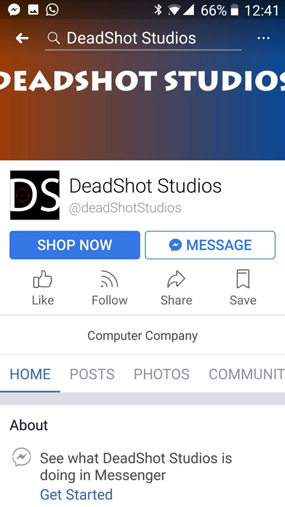
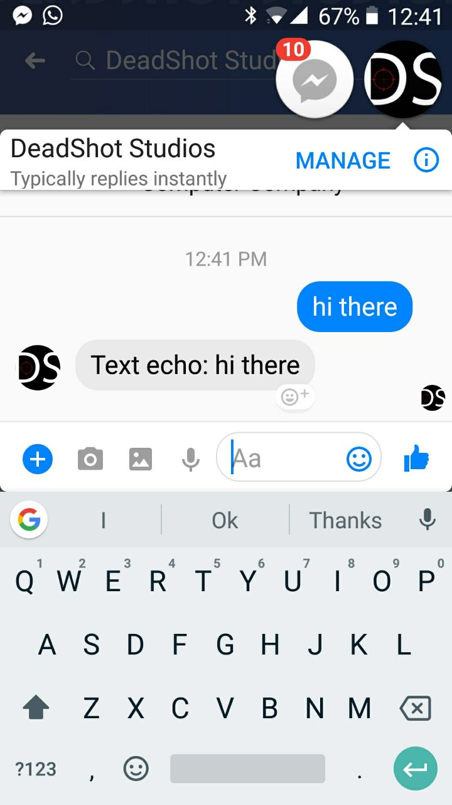

# Messenger Bot

### A facebook messenger bot for DeadShot Studios

#### Steps to set up project ####

Make sure npm and nodejs are installed on your machine.

Clone the repository on your local machine and run.

Make a secret.json file in the main directory with the structure of demo_secret.json

Go to the facebook developers console and make a new app.
Generate an Page access token. Put this in the app token field.

Deploy the project online (using heroku or some other service) and setup webhooks on the facebook developer console.

[DeadShot Studios page on Facebook](https://www.facebook.com/deadShotStudios/)


#### Project ScreenShots

<p align="center">
&nbsp&nbsp&nbsp&nbsp&nbsp&nbsp&nbsp&nbsp
</p>

<br/>

#### Steps to run project ####

```bash
npm install
```
##### Running the project

Deploy project

```bash
git push heroku master
```
